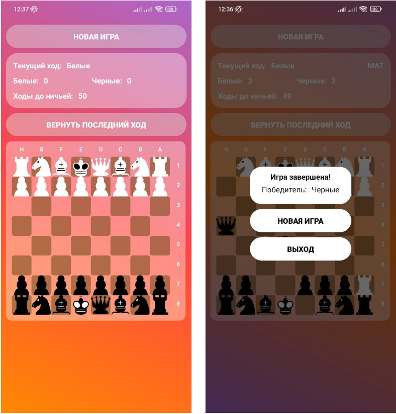

# Chess-app | Java | Android Studio
Practical part of my second scientific research work, implementation of famous logic game in mobile.

*Visualization taken from a previous project*

**Checkers AI** is an implemented *minimax algo with alpha-beta-pruning and failure amortization*.
Moves *node tree* builds recursievly every AI's move.
This application has translation into English and Russian (based on system language).

UML class diagram: [Development doc](./dev.md)

**Demonstration screenshots:**
