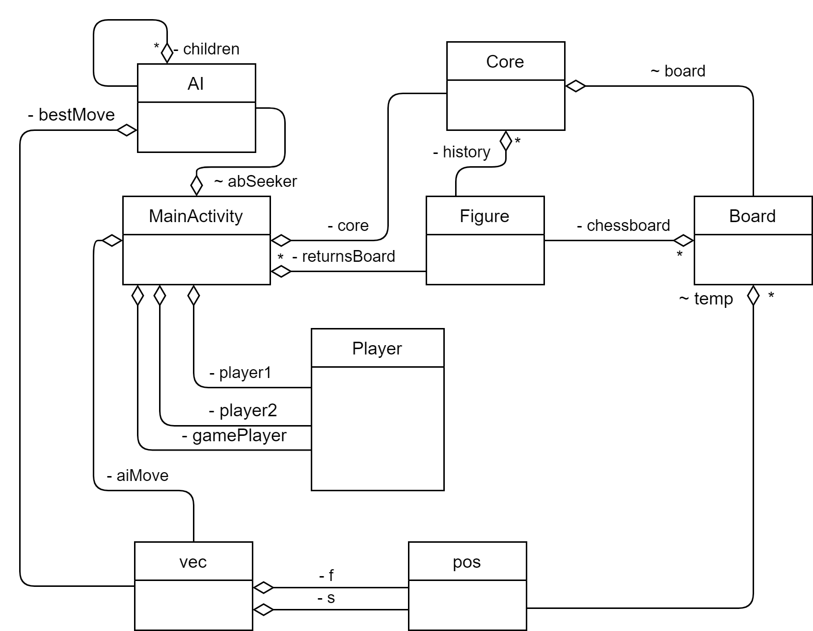

# Chess-app | Java | Android Studio
You can find UML(Unified Modeling Language) class diagrams of this project here.

Developed classes:
1. Core class: is the core of the game, controls the moves of the players, monitors the implementation of the rules of the game.
2. The MainActivity class: is responsible for the graphic component and implements input-output, updates the score, is responsible for returning the player's move.
3. Board class: contains a chessboard and functions for changing its state (functions for making and checking moves according to the rules).
4. Player class: contains information about the player. It stores the color of the player's pieces, his status (real player or AI), the direction of movement of the pieces (for pawns).
5. Class vec: contains the start and end coordinates of the shape's path.
6. The pos class: contains the position of the piece on the chessboard, is part of the vec class.
7. Class Figure: represents one of the pieces on the chessboard. Contains the type of piece, its color, position on the board.
8. AI class: implements an opponent when choosing *Player vs. AI* mode. It contains the position estimation function and the implementation of the minimax algorithm with alpha-beta pruning. The recursive algorithm uses a positional evaluation of the states of the chessboard.

UML class diagram:

